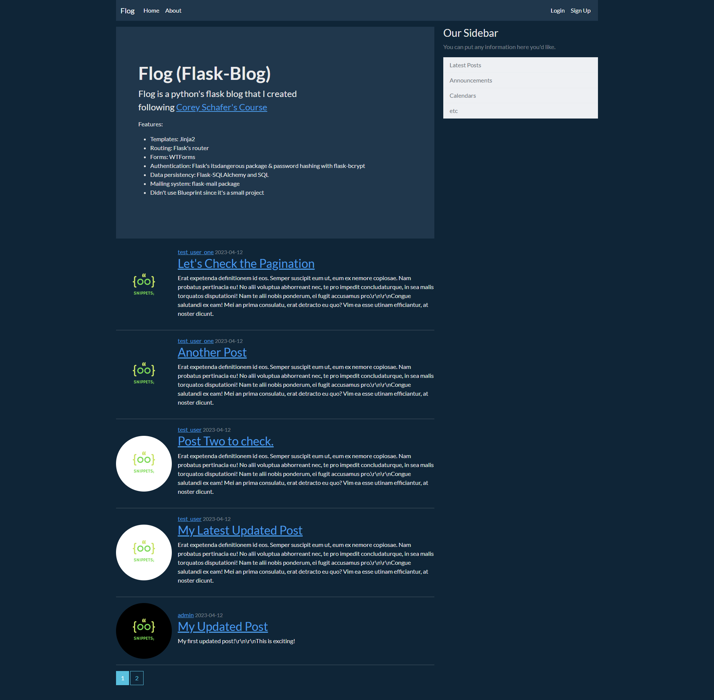

# Python's Flask Blog.

Code along with [Corey's Schafer Course](https://www.youtube.com/playlist?list=PL-osiE80TeTs4UjLw5MM6OjgkjFeUxCYH)

### summary:

an awesome course as introduction to python's [Flask](https://flask.palletsprojects.com/en/2.3.x/) micro-framework and built this blog with it.

### features:

- Templating with [Jinja](https://jinja.palletsprojects.com/en/3.1.x/).
- Routing with flask router
- used [WTForms].(https://wtforms.readthedocs.io/en/3.0.x/) for handling user input forms.
- Authentication System.
- Data persistency.
- Mailing system.
- Didn't use Blueprint in this app.

 

 

 

 

### Live Demo: to be updated.

#### Tested on GitHub's Codespaces.
